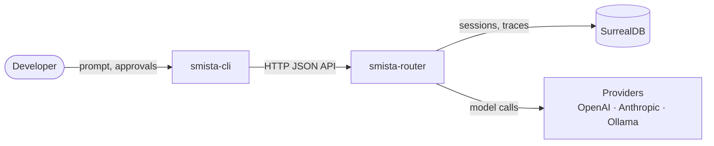
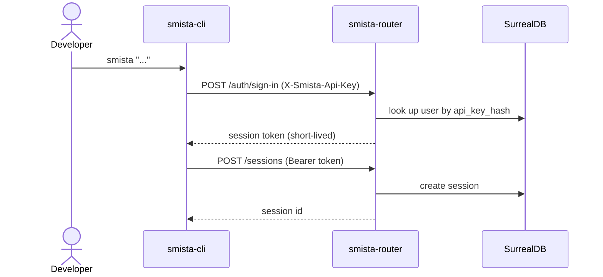
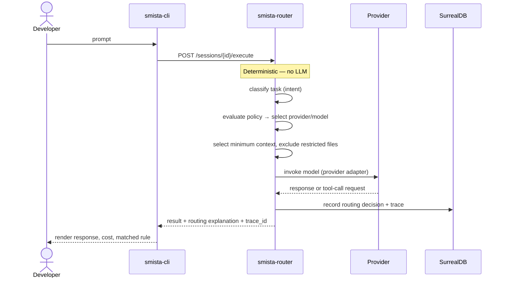
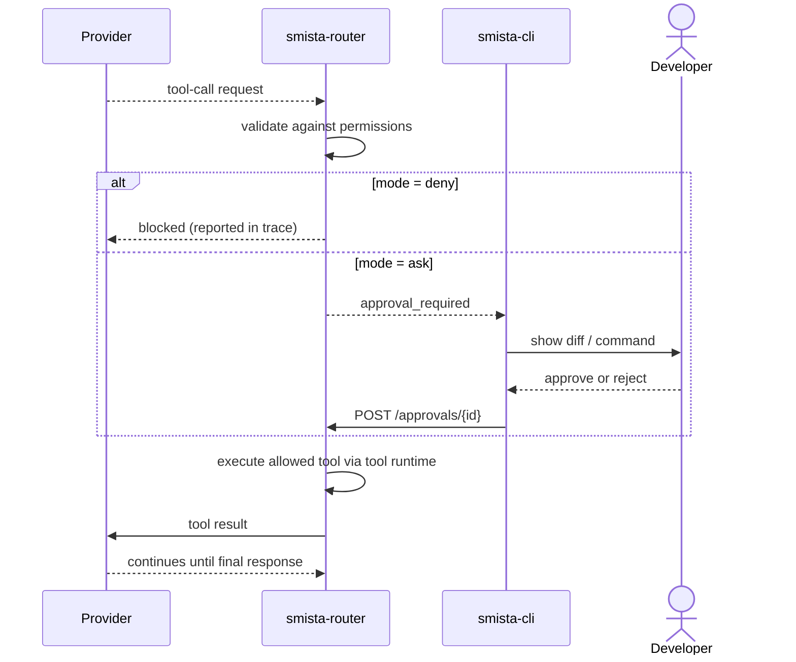
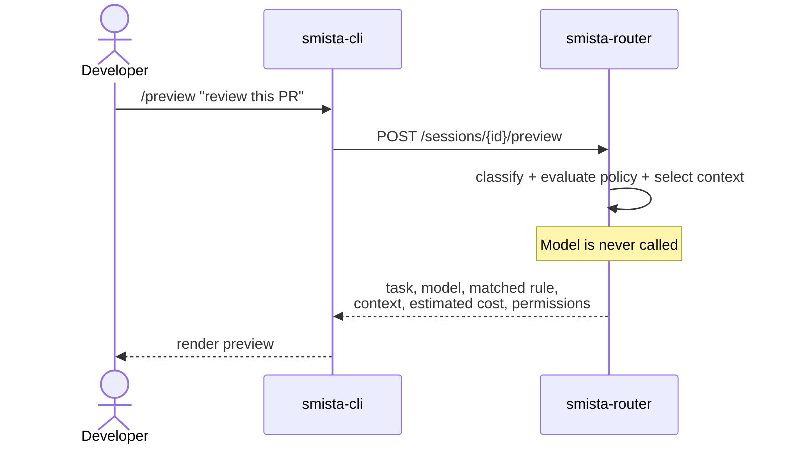

# Architecture

- [Architecture](#architecture)
  - [Components](#components)
  - [Principles](#principles)
  - [How the pieces talk](#how-the-pieces-talk)
  - [Sign-in and session start](#sign-in-and-session-start)
  - [Executing a task](#executing-a-task)
  - [Tool calls and approvals](#tool-calls-and-approvals)
  - [Route preview](#route-preview)

smista.ai is composed of a small set of clearly separated components. The goal
is to keep the CLI experience simple while providing an easy-to-run router as
its backend.

## Components

| Component              | Kind           | Responsibility                                                                                         |
| ---------------------- | -------------- | ------------------------------------------------------------------------------------------------------ |
| `smista-cli`           | CLI binary     | User interaction, command parsing, rendering, approvals, runs and talks to router.                     |
| `smista-router`        | Library        | Auth, sessions, classification, routing, context, tool mediation, traces; embedded and run by the CLI. |
| `smista-router-client` | Library        | Async Rust client for the router HTTP API; used by the CLI and Rust frontends.                         |
| `smista-core`          | Library        | Shared domain types, config, policy, trace structures, validation, errors.                             |
| `smista-providers`     | Library        | Model abstraction and provider adapters (OpenAI, Anthropic, Ollama, …).                                |
| `smista-storage`       | Library        | Storage traits, entities (incl. trace events) and the SurrealDB layer.                                 |
| `@smista-ai/sdk`       | TypeScript SDK | Typed client over the router HTTP API.                                                                 |

## Principles

- **Local-first by default** — the CLI and router run on localhost; config,
  policies, skills, prompts and traces live locally and can be versioned.
- **Deterministic over magical** — routing never relies on an LLM. Explicit
  rules and policies guide model selection.
- **Traceability** — every routing decision is explainable via a trace.
- **Least-context routing** — each model receives only the minimum context
  required for its task; full session context is never forwarded by default.
- **User control before automation** — file writes, shell commands, network
  access and sensitive context disclosure require approval.

## How the pieces talk

The CLI never decides which model runs a task — it only expresses preferences
and renders results. Every routing decision belongs to the router.

## Sign-in and session start

## Executing a task

This is the golden path: classify, route, select context, call the model, return
a result and a trace.

## Tool calls and approvals

Models never touch the filesystem, shell or network directly. The router
mediates every tool call against the active permissions.

## Route preview

`/preview` explains the decision without calling any model.

