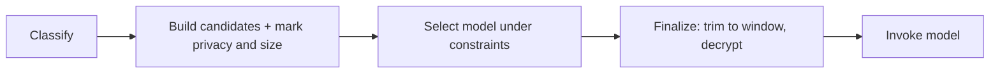

# Context selection

- [Context selection](#context-selection)
  - [What the router draws on](#what-the-router-draws-on)
  - [Building the candidate set](#building-the-candidate-set)
  - [Relevance and privacy](#relevance-and-privacy)
  - [Fitting the window](#fitting-the-window)
  - [Opening sealed history](#opening-sealed-history)
  - [What gets recorded](#what-gets-recorded)
  - [Where it sits in a turn](#where-it-sits-in-a-turn)

Context selection decides what actually goes into the prompt. It runs **on the
router**, it is **deterministic** (never an LLM), and it is **filter-only**: it
ranks and trims material the router already holds, and never reads the
filesystem. It sits between [routing](./routing.md) and the model call, and it
feeds model selection, because what is in the context decides which models may
serve the turn.

This document follows the `smista-core` types `Attachments`, `ContextOutcome`,
`PrivacyPolicy`, `ModelDescriptor` and the crypto payloads (`SealedRecord`,
`PlainRecord`), plus the storage entities `session_message`, `user_memory`,
`context_memory` and `session_context_reference`.

## What the router draws on

The candidate material comes from two places, never from disk directly:

| Source             | Comes from                                                                                              |
| ------------------ | ------------------------------------------------------------------------------------------------------- |
| Session history    | `session_message` rows recalled from storage, each tagged with the provider and model that produced it. |
| Memory             | user-wide `user_memory` and per-session `context_memory` facts.                                         |
| Client attachments | the request's `attachments`: files (with content and a `required` flag), instructions, skills.          |
| Workspace metadata | the request's `workspace`: git branch and diff, referenced paths, the active file.                      |

The filesystem-derived parts (attachments, workspace) arrive in the request
because the router cannot read them; everything else is recalled from storage.

## Building the candidate set

The router assembles these into a single, model-agnostic **candidate set**. Each
candidate carries a kind (message, file, instruction, memory, diff), a path when
it has one, and a size estimate from the router's deterministic token estimator.
This is the universe the rest of the stage filters down.

## Relevance and privacy

Two deterministic passes shape the set:

- **Relevance.** Rank and keep the candidates that bear on the task (recency,
  explicit reference, a path that matches the task, a relevant skill) and drop
  the rest. Filter-only, no model involved.
- **Privacy.** Mark each candidate. A candidate is **restricted for remote**
  when its path matches `PrivacyPolicy::is_restricted_for_remote` (the union of
  `restricted_paths`, `remote.blocked_paths` and any `local_only` rule's paths),
  and **required** when it was referenced, attached as a required file, or drove
  the route, as opposed to discardable supplementary context.

These marks feed [model selection](./routing.md#locality-and-privacy): required
restricted content forecloses remote models, and discardable restricted content
is dropped when the route is remote. Privacy here is a routing input, not a
redaction after the fact.

## Fitting the window

Once the model is selected, the set is finalized to fit. The estimated input is
checked against the model's `max_context_tokens` via
`ModelDescriptor::can_handle` (`context_window_exceeded` when it does not fit).
The router keeps every **required** candidate plus as much relevant discardable
context as fits, computing the minimum viable context.

A required candidate is never dropped to make room. If even the minimum required
context cannot fit the selected model, the turn does not silently truncate: it
raises `context_window_exceeded`, which the selection stage treats as a
fallback-eligible failure and walks the fallback chain toward a model with a
larger window.

## Opening sealed history

In an [encrypted session](./e2e.md) the recalled history is ciphertext: the
router is blind at rest and holds no key. Selection still works, because it runs
on the cleartext metadata (role, provider, paths, timestamps) while only the
content is sealed. Once the router knows which past rows it needs, it emits an
`awaiting_decrypt` turn carrying those rows as `SealedRecord`s; the client opens
them with the session key and returns `PlainRecord`s in the `/continue` bundle,
and the router builds the prompt. A plaintext session skips this entirely.

## What gets recorded

The selection is reported to the client as a `ContextOutcome` (human-readable
`included` and `excluded` descriptions) and persisted as `session_context_reference`
rows: `path`, `kind`, `included` and a `reason`. These are references and
metadata only, never the file contents, and restricted content is not persisted
unless policy allows. A trace therefore shows exactly what was included or
excluded and why.

## Where it sits in a turn

Context selection straddles model selection: the candidate set and its privacy
and size marks are built **before** the model is chosen (so they can constrain
the choice), and the set is trimmed and decrypted **after** (against the chosen
model's window). Like the rest of the pipeline it re-runs on
[every turn](./execution-protocol.md#the-turn-loop), so the context tracks the
work as it evolves.
