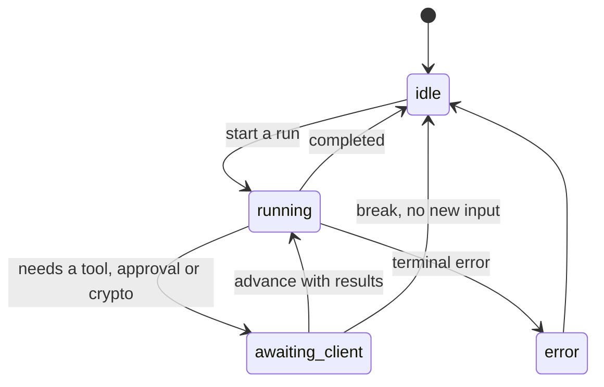
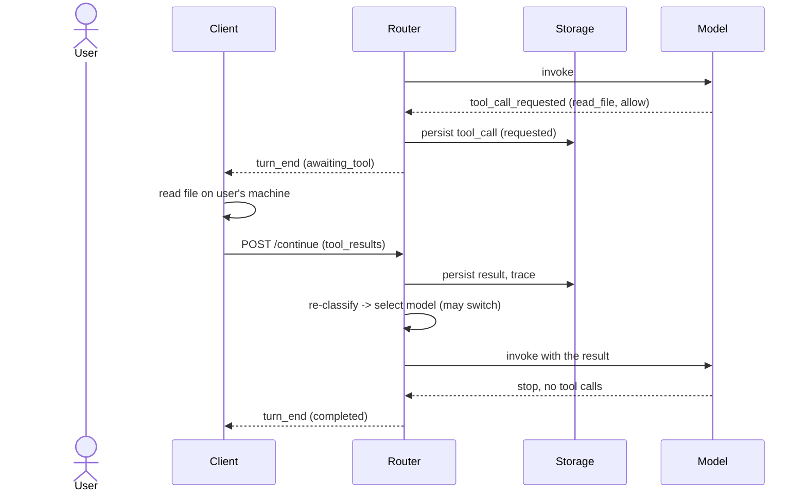
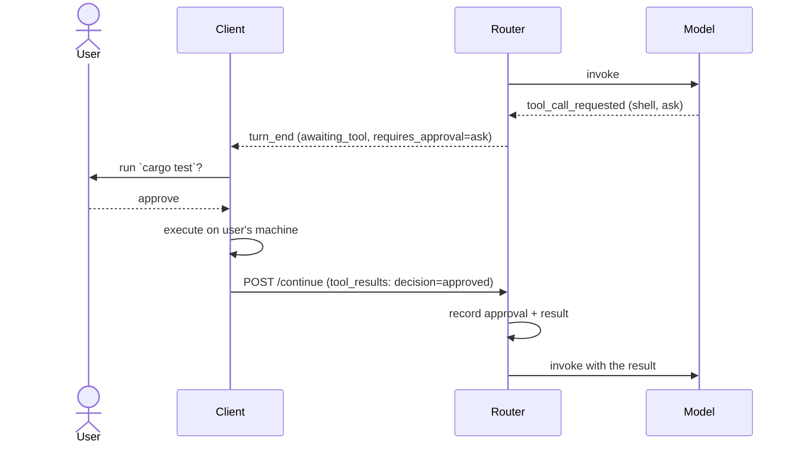
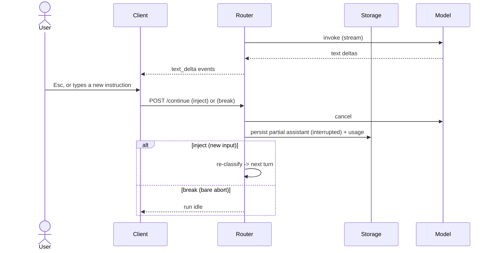
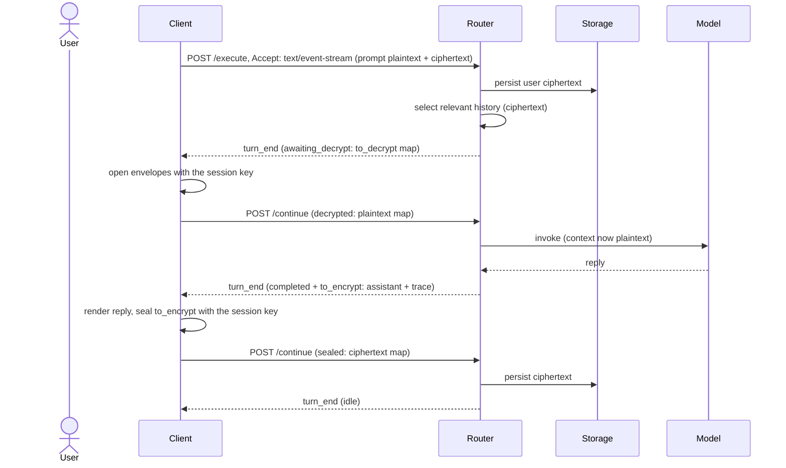

# Execution protocol

- [Execution protocol](#execution-protocol)
  - [Roles and ownership](#roles-and-ownership)
  - [What the client sends](#what-the-client-sends)
  - [What the router owns](#what-the-router-owns)
  - [Run lifecycle](#run-lifecycle)
  - [The turn loop](#the-turn-loop)
  - [Starting a run](#starting-a-run)
    - [Request body](#request-body)
    - [Response: completion or continuation](#response-completion-or-continuation)
  - [Continuations](#continuations)
    - [Tool requests](#tool-requests)
    - [Approvals](#approvals)
    - [Decrypt and encrypt](#decrypt-and-encrypt)
  - [Advancing a run](#advancing-a-run)
  - [Streaming](#streaming)
  - [Mid-run input and aborting](#mid-run-input-and-aborting)
  - [Privacy and model locality](#privacy-and-model-locality)
  - [Sequence diagrams](#sequence-diagrams)
    - [Single turn, no tools](#single-turn-no-tools)
    - [Tool mediation](#tool-mediation)
    - [Approval for a sensitive action](#approval-for-a-sensitive-action)
    - [Aborting and mid-run input](#aborting-and-mid-run-input)
    - [An encrypted run](#an-encrypted-run)
  - [Error and terminal states](#error-and-terminal-states)

This document specifies how a client and `smista-router` talk while a task
runs: the request the client sends, the continuations the router asks back for,
how results are correlated, and where the streaming events fit. It is the
authoritative contract behind the `execute`, `stream`, `continue` and `preview`
sections of the [HTTP API reference](../api/http-api.md); that page gives the
wire-level JSON, this page gives the model behind it.

The single invariant everything below serves: **routing is deterministic and
never depends on an LLM.** The router classifies, matches policy, selects a
model and assembles context by fixed rules; the client only expresses
preferences, executes on the user's machine, and renders results.

## Roles and ownership

A task is a conversation between two parties with a strict division of labour.

| Party      | Owns                                                                                                                                |
| ---------- | ----------------------------------------------------------------------------------------------------------------------------------- |
| **Router** | Classification, policy evaluation, model selection, context selection, tool mediation, persistence (history, memory, trace).        |
| **Client** | The user's machine: the filesystem, tool execution, the approval UI, and — for encrypted sessions — the session key and the crypto. |

The router may be **remote**. The protocol never assumes the router shares a
filesystem or a host with the client, which is why the client must ship file
contents itself and why end-to-end encryption exists (see
[End-to-end encryption](./e2e_encryption.md)).

Two trust boundaries follow, and they are not the same:

- **Client to router.** Everything the task needs travels here, sensitive
  content included. The router is trusted by its owner.
- **Router to model.** Privacy is enforced here. Sensitive content may reach a
  `local` model but is **never** placed in a prompt sent to a remote provider.
  See [Privacy and model locality](#privacy-and-model-locality).

## What the client sends

When it starts a run the client sends only what the router cannot obtain for
itself — the prompt, the local files and skills, and the policy:

| Field                          | Contents                                                                                              |
| ------------------------------ | ----------------------------------------------------------------------------------------------------- |
| `input`                        | The prompt `text`, an optional `command` (forces the intent) and an optional `explicit_model`.        |
| `workspace`                    | Repository snapshot: `root`, `git_branch`, `git_diff`, referenced paths, active file.                 |
| `attachments.files`            | Explicit `@path` files **with content** and a `content_hash`, each flagged `required` or discardable. |
| `attachments.instructions`     | Instruction documents the client read from disk (for example `AGENTS.md`).                            |
| `attachments.invoked_skills`   | Skills the user explicitly invoked, each `name` + `content` (the `SKILL.md` body).                    |
| `attachments.available_skills` | Skills offered for the model to activate, same `name` + `content` shape.                              |
| `policy`                       | The deterministic `routing`, `tools` and `privacy` policy, sent verbatim.                             |
| `local_preferences`            | Resolved client toggles: `auto_apply`, `stream`, `local_only`, `no_network`.                          |
| `providers`                    | Providers offered for this run and the per-model credential status.                                   |

The router cannot read the filesystem, so every file, instruction and skill the
task may need from disk is the client's to supply. Skills travel as `name` plus
their `SKILL.md` content, and they do not influence routing. The router never
discovers a skill or infers relevance: the **invoked** skills are added to the
model preamble, while the **available** skills are offered for the model to
activate.

What the client does **not** send: session history, memory, or any assembled
context. Those are the router's.

## What the router owns

The router recalls everything that lives in storage, deterministically, and the
client never supplies it:

- **Session history** — prior messages, each tagged with the provider and model
  that produced it, so the conversation is model-agnostic and any model can pick
  it up.
- **Memory** — user-wide and per-session facts.
- **Assembled context** — the candidate set selected from history, memory and
  the client's attachments, filtered by privacy and trimmed to the chosen
  model's window.

Context selection is **filter-only**: the router ranks and trims candidates it
already holds. It never gathers from the filesystem.

## Run lifecycle

A **run** is one user prompt carried to a terminal state. A session has **at
most one in-flight run**.



`awaiting_client` means a [continuation](#continuations) is outstanding — the
router needs the client to run a tool, decide an approval, or seal/open
ciphertext before it can proceed.

The run's state lives in storage, not in router memory, so a dropped connection
or a remote router never loses it. The full set of pause states, the processing
lock that rejects parallel requests, and where each wait resumes are specified in
the [run state machine](./run-state-machine.md); this page covers the wire
protocol. One rule makes abort, mid-run input and reconnection share a single
path:

> **Supersede rule.** A new client request for a run cancels any in-flight turn
> for that run — the partial output is persisted, pending tool calls are
> cancelled — and the new request starts the next turn.

## The turn loop

A run is a loop of **turns**. A turn is one model invocation. The model that
serves a turn can differ from the one that served the previous turn: history is
model-agnostic and rebuilt each turn, so a switch is transparent. Each turn:

1. **Classify** the current step from current workflow state — the prompt,
   history so far, the latest tool results, referenced paths and any invoked
   skill. State grows every turn, so the intent can change.
2. **Assemble candidate context** — relevance-filter history, memory and the
   client's attachments. Classify each candidate's privacy (restricted for
   remote or not) and size. This is model-agnostic.
3. **Select the model** under the candidates' constraints — locality (see
   [Privacy and model locality](#privacy-and-model-locality)), required
   capabilities, and fit to the window — then walk the fallback chain if the
   first choice is unavailable.
4. **Finalize context** — trim to the chosen model's window and decrypt sealed
   history if the session is encrypted.
5. **Invoke** the model, buffered or streamed.
6. The turn ends in one of two ways: the model stops with no tool calls, so the
   run **completes**; or the model requests tool calls, which the router
   **mediates** with the client before looping to step 1.

Re-classification fires before **every** invocation. Routing follows the
drifting intent — a run can plan with a reasoning model, edit with a coding
model and review with another, each chosen deterministically. The router never
sequences phases itself; phases emerge from the loop, exactly as a turn ends and
the user sends the next prompt.

## Starting a run

```http
POST /sessions/{session_id}/execute   # buffered, or streamed via Accept
```

Starts a run from a new user prompt. `execute` returns the turn's outcome as one
JSON body by default, or as server-sent events when the client sends
`Accept: text/event-stream` (see [Streaming](#streaming)). `preview` takes the
same body but never calls a model.

### Request body

```json
{
  "input": { "text": "refactor the auth middleware", "command": "edit", "explicit_model": null },
  "workspace": {
    "root": "/Users/christian/project",
    "git_branch": "main",
    "git_diff": "...",
    "referenced_paths": ["src/auth/middleware.rs"],
    "active_file": null
  },
  "attachments": {
    "files": [
      { "path": "src/auth/middleware.rs", "content": "...", "content_hash": "sha256:...", "required": true }
    ],
    "instructions": [{ "source": "AGENTS.md", "content": "..." }],
    "invoked_skills": [],
    "available_skills": []
  },
  "policy": { "version": 1, "source": "merged", "classification": { }, "routing": { }, "tools": { }, "privacy": { } },
  "local_preferences": { "auto_apply": false, "stream": true, "local_only": false, "no_network": false }
}
```

The `policy` block is the canonical routing, tool-permission and privacy
vocabulary, sent verbatim — see the [HTTP API reference](../api/http-api.md) for
its fields. The body never lists providers or credentials: the router owns the
model catalog and reads any provider credentials from the request headers. For
an encrypted session the content the router authors and persists is sealed
through the encrypt turn (see [Decrypt and encrypt](#decrypt-and-encrypt)).

### Response: completion or continuation

A turn resolves to one envelope with three top-level fields: `status` names the
outcome, `data` carries that outcome's payload, and `allowed_continuations` lists
the messages the client may send next. The outcomes are:

| `status`            | Meaning                                                          | Client's next move                           |
| ------------------- | ---------------------------------------------------------------- | -------------------------------------------- |
| `completed`         | The model finished; an assistant message is included.            | Render; seal `to_encrypt` if set, else done. |
| `awaiting_tool`     | The model requested one or more client-executed tools.           | Run them; advance with the results.          |
| `awaiting_approval` | The router needs a yes/no with no tool to run.                   | Ask the user; advance with the decision.     |
| `awaiting_decrypt`  | The router needs sealed history opened to build the prompt.      | Decrypt; advance with the plaintext.         |
| `awaiting_encrypt`  | The router needs its own output sealed before it can persist it. | Seal; advance with the ciphertext.           |
| `idle`              | The run finished and its content was persisted.                  | Nothing to render; the run is over.          |
| `error`             | A terminal error ended the turn.                                 | Surface it; the run is over.                 |

`allowed_continuations` is empty for a terminal outcome and otherwise always
includes `break`. A `completed` turn is terminal for a plaintext session; for an
encrypted session its `data` carries a `to_encrypt` map and `allowed_continuations`
is `[sealed, break]`, after which the router answers `idle`.

A completed turn:

```json
{
  "status": "completed",
  "data": {
    "message": { "role": "assistant", "content": "...", "provider": "anthropic", "model": "claude-sonnet" },
    "classification": { "intent": "edit", "source": "inferred", "reason": "keyword matched", "confidence": "high" },
    "routing": {
      "task_type": "edit",
      "provider": "anthropic",
      "model": "claude-sonnet",
      "matched_rule": "edit + src/auth/** -> anthropic/claude-sonnet",
      "fallback_used": false,
      "override_used": false
    },
    "context": { "included": ["src/auth/middleware.rs", "AGENTS.md"], "excluded": [".env"] },
    "usage": { "input_tokens": 1200, "output_tokens": 500, "estimated_cost": "0.08", "currency": "USD" },
    "trace_id": "trace:xyz"
  }
}
```

Every non-terminal `status` is a [continuation](#continuations); the client does
the work and resumes the run with [`/continue`](#advancing-a-run).

## Continuations

A continuation is the router handing control to the client because only the
client can do the next step — run a tool on the user's machine, get a decision,
or touch the session key.

### Tool requests

When the model requests tools, the router checks each call against
`tools.permissions` before involving the client:

| Mode    | What the router does                                                                         |
| ------- | -------------------------------------------------------------------------------------------- |
| `deny`  | Synthesizes a "denied by policy" tool result and feeds it back to the model. No client trip. |
| `allow` | Returns the call to the client to execute.                                                   |
| `ask`   | Returns the call to the client, flagged for approval, to confirm **and** execute.            |

`deny` never reaches the client. The rest surface as `awaiting_tool`:

```json
{
  "status": "awaiting_tool",
  "data": {
    "tool_requests": [
      { "call_id": "c1", "name": "read_file", "arguments": { "path": "src/auth/middleware.rs" }, "requires_approval": "allow" },
      { "call_id": "c2", "name": "shell", "arguments": { "command": "cargo test" }, "requires_approval": "ask" }
    ],
    "trace_id": "trace:xyz"
  },
  "allowed_continuations": ["tool_results", "inject", "break"]
}
```

`requires_approval` is `allow` (run it) or `ask` (confirm with the user first).
The client executes each call, correlated by `call_id`, and advances the run
with the results.

A tool that takes a file path may receive a **relative** one. The client
resolves it against the workspace root (`workspace.root`), and, for a path an
active skill refers to, against that skill's own directory. The router never
resolves paths itself.

### Approvals

Approval is **folded into the tool result**. For an `ask` call the client — the
same machine that approves and executes — asks the user, then runs the tool if
approved or reports a rejection, in a single advance. The router records the
`session_approval` from the reported `decision`. There is no separate approval
round trip for a tool.

A standalone `awaiting_approval` is reserved for decisions with **no tool to
execute** — chiefly disclosing context to a remote provider when
`privacy.remote.mode` is `ask`, an optional `cost_limit` confirmation, and
accepting or rejecting a generated `plan` before execution begins:

```json
{
  "status": "awaiting_approval",
  "data": {
    "approval": {
      "approval_id": "a1",
      "kind": "remote_disclosure",
      "detail": { "provider": "anthropic", "model": "claude-sonnet", "paths": ["src/auth/middleware.rs"] }
    },
    "trace_id": "trace:xyz"
  },
  "allowed_continuations": ["approval_decisions", "break"]
}
```

`kind` is `remote_disclosure`, `cost_limit` or `plan`. The client returns the
decision in the advance bundle.

### Decrypt and encrypt

In an encrypted session the router holds only ciphertext and no key, so it leans
on the client for crypto. The two directions differ (see
[End-to-end encryption](./e2e_encryption.md), and the
[run state machine](./run-state-machine.md) for the resume points):

- **Decrypt is a standalone step.** To build the prompt the router needs sealed
  history opened, and cannot proceed without it. `awaiting_decrypt` sends a
  `to_decrypt` map; the client opens it and advances with the plaintext. When the
  same pause also has router-authored content to seal — most often the run-input
  bundle and the user message sealed at run start — it folds a `to_encrypt` map
  alongside `to_decrypt`, and the `decrypted` continuation returns the opened
  plaintext together with the sealed ciphertext.
- **Encrypt rides the data response.** Content the router authors (the assistant
  reply, tool-call arguments, a plan snapshot, trace payloads, an interrupted
  partial) travels out as a `to_encrypt` map **on the data-bearing response**;
  the client seals it and returns the ciphertext on its next continuation. Only
  the ciphertext is stored, and the user never waits to see the output. A
  completed turn with nothing else outstanding uses the dedicated `sealed`
  continuation; `awaiting_encrypt` is the standalone case (an interrupted
  partial).

Both maps are keyed by a content reference of the form `kind:id`, where `kind` is
one of `message`, `tool_call`, `diff`, `plan`, `memory`, `trace` or `run_input`,
so the router dispatches each payload to the right content store:

```json
{
  "status": "awaiting_decrypt",
  "data": {
    "to_decrypt": {
      "message:0194": { "version": 1, "algorithm": "xchacha20poly1305", "key_id": "kf_ab12", "nonce": "...", "ciphertext": "..." }
    },
    "trace_id": "trace:xyz"
  },
  "allowed_continuations": ["decrypted", "break"]
}
```

A plaintext session never sees decrypt or encrypt; `to_encrypt` is absent and the
router stores content directly.

## Advancing a run

```http
POST /sessions/{session_id}/continue
```

`continue` resumes the in-flight run with a single tagged `{ type, data }`
message answering the current pause. It returns the next turn's outcome in the
same shape as [`/execute`](#response-completion-or-continuation), buffered or
streamed by the `Accept` header. The valid `type` values are what the previous
response advertised in `allowed_continuations`; `break` is always valid.

| `type`               | Answers             | `data`                                                               |
| -------------------- | ------------------- | -------------------------------------------------------------------- |
| `tool_results`       | `awaiting_tool`     | `{ results: [{ call_id, content, is_error, decision }], encrypted }` |
| `approval_decisions` | `awaiting_approval` | `{ decisions: [{ approval_id, decision, reason }], encrypted }`      |
| `decrypted`          | `awaiting_decrypt`  | `{ plaintext, encrypted }` — opened plaintext plus any sealed rows   |
| `sealed`             | a folded encrypt    | `{ encrypted }` — a content-ref → envelope map                       |
| `inject`             | any live state      | `{ messages: [{ text, ciphertext }] }` — mid-run input; supersedes   |
| `break`              | any live state      | none — aborts the in-flight turn (the Esc path)                      |

A tool's approval rides the `decision` on its result, so an `ask` call confirms
and executes in one message. In an encrypted session the client's `encrypted`
map carries the ciphertext for the router-authored rows the response asked it to
seal (and for the tool results themselves), keyed by content reference.

```json
{
  "type": "tool_results",
  "data": {
    "results": [
      { "call_id": "c1", "content": "pub fn middleware() { ... }", "is_error": false },
      { "call_id": "c2", "content": "test result: ok", "is_error": false, "decision": "approved" }
    ]
  }
}
```

```json
{ "type": "break" }
```

This single endpoint replaces the old standalone approval endpoint: approval
decisions ride `approval_decisions`, and tool approvals ride the `decision` on a
tool result. Mid-run input and aborts are their own messages (`inject` and
`break`), each superseding the in-flight turn.

## Streaming

`stream`, and `continue` when the client asks for it, deliver a turn as
server-sent events. Each event is one JSON object tagged by `type`:

| `type`                | When                                                                      |
| --------------------- | ------------------------------------------------------------------------- |
| `text_delta`          | A chunk of generated text.                                                |
| `reasoning_delta`     | A chunk of reasoning, for models that stream it.                          |
| `tool_call_started`   | A tool call's name is known; arguments are still streaming.               |
| `tool_call_requested` | A tool call is complete, correlated by `call_id`.                         |
| `usage`               | Token counts and, when the model prices them, the cost.                   |
| `turn_end`            | The terminal event; carries the turn's `status` and continuation payload. |

The stream always ends with exactly one `turn_end`, whose `status` is the same
value the buffered response carries. For `awaiting_tool` the calls have already
arrived as `tool_call_requested` events, and `turn_end` signals "this turn is
done generating; execute and continue." For `completed` it carries the message,
routing, context, usage and `trace_id`. A failure ends the stream with
`turn_end` of `status: error` and nothing after it.

Models that cannot stream still answer here: the full response is replayed as a
short stream of the same events. The client never has to infer whether a turn
completed or paused — `turn_end` says so explicitly.

## Mid-run input and aborting

The user can type while a run is working, or abort it. Both are their own
[`/continue`](#advancing-a-run) messages, and both are always accepted — even
while a turn is generating:

- **`inject`** — mid-run input ("stop, do Y instead"). The router appends it to
  the conversation **after** the current turn's output and tool results,
  persists it, and the next turn's classification consumes it as fresh state, so
  routing adapts on its own. No special engine: injected input is simply more
  state at the loop head, picked up for free by per-turn re-classification.
- **`break`** — a bare abort with no input (the Esc path).

Both apply the supersede rule: the router cancels the model call, **persists the
partial assistant turn marked interrupted** (with whatever usage the provider
reported before the cut — it may be incomplete), and cancels any unresolved
pending tool calls. After that, `inject` continues the run with the new input,
while `break` lets the run go idle and wait for the next prompt. In an encrypted
session the interrupted partial is router-authored content, so it rides the
encrypt path before it is stored.

## Privacy and model locality

Privacy is a **routing input**, not a redaction step — it shapes which model may
serve a turn, so sensitive content reaching a remote model is unreachable by
construction, never a state the router has to clean up.

A context item is **locality-constrained** when its path matches the union of
`privacy.restricted_paths`, `privacy.remote.blocked_paths`, and the `paths` of
any `local_only` routing rule. Combined with whether the item can be dropped:

| Item                         | Behaviour                                                                                                       |
| ---------------------------- | --------------------------------------------------------------------------------------------------------------- |
| **Required, constrained**    | Remote is foreclosed for the turn. **Local-only always wins** — over rule precedence and over `explicit_model`. |
| **Discardable, constrained** | Excluded from the prompt when the route is remote. Nothing required is lost.                                    |
| Unconstrained                | Sent freely to a local model; to a remote model subject to `privacy.remote.mode`.                               |

A **required** item is one the user referenced (`@path`, the active file) or a
path that drove the route; it cannot be silently dropped. A **discardable** item
is supplementary context the window-fit step would trim anyway.

The honest failures — neither is a leak, both are refusals:

- Required, constrained content with **no eligible local model** → the run fails
  loud (`no_route`-class), rather than ship a gutted prompt to a remote model.
- An `explicit_model` override to a **remote** model on constrained required
  content → the override is **refused** (`override_not_allowed`). Override
  bypasses routing, never the privacy floor.

`privacy.remote.mode` independently gates disclosing the unconstrained remainder
to a remote model: `allow` sends it, `ask` raises an `awaiting_approval`
(`remote_disclosure`), `deny` keeps it local. A forward-time strip of any
constrained content that slips into a remote prompt remains only as an internal
invariant — it should never fire.

## Sequence diagrams

The participants: the **user**, the **client** (the CLI on the user's machine),
the **router**, the **model**, and **storage**.

### Single turn, no tools

```mermaid
sequenceDiagram
    actor User
    participant Client
    participant Router
    participant Storage
    participant Model

    User->>Client: prompt
    Client->>Router: POST /execute, Accept: text/event-stream (input, attachments, policy, ...)
    Router->>Storage: persist user message; recall history + memory
    Router->>Router: classify -> select context -> select model -> finalize
    Router->>Model: invoke (stream)
    Model-->>Router: text deltas
    Router-->>Client: text_delta events
    Model-->>Router: stop, no tool calls
    Router->>Storage: persist assistant message, usage, trace
    Router-->>Client: turn_end (completed)
    Client-->>User: render
```

### Tool mediation



### Approval for a sensitive action



### Aborting and mid-run input



### An encrypted run



## Error and terminal states

A run ends in `completed`, `error`, or idle after a bare `break`. Errors use
the shared error shape and stable `code` from the
[HTTP API reference](../api/http-api.md#error-codes); the ones the execution
flow raises most often:

| Code                      | When                                                                                          |
| ------------------------- | --------------------------------------------------------------------------------------------- |
| `no_route`                | No rule matched and no default route — or no eligible local model for constrained content.    |
| `override_not_allowed`    | An `explicit_model` override was refused, including a remote override on constrained content. |
| `fallback_exhausted`      | The selected model and every fallback failed.                                                 |
| `context_window_exceeded` | The minimum required context cannot fit the selected model's window.                          |
| `missing_capability`      | The selected model lacks a capability the task requires.                                      |

A terminal error is surfaced once, as `status: error` (or a `turn_end` of
`status: error` when streaming), and the run is over; the session stays and the
user can start a new run.
