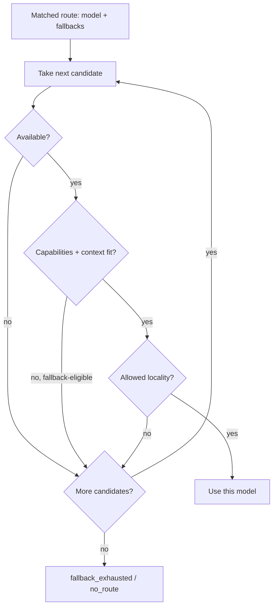

# Routing and model selection

- [Routing and model selection](#routing-and-model-selection)
  - [The routing context](#the-routing-context)
  - [Matching a rule](#matching-a-rule)
    - [Match conditions](#match-conditions)
    - [Precedence](#precedence)
    - [The default route](#the-default-route)
  - [Selecting the model](#selecting-the-model)
    - [Resolving and availability](#resolving-and-availability)
    - [Capability and context validation](#capability-and-context-validation)
    - [Fallback](#fallback)
    - [Locality and privacy](#locality-and-privacy)
  - [What a matched route carries](#what-a-matched-route-carries)
  - [The routing outcome](#the-routing-outcome)
  - [Worked example](#worked-example)
  - [Refinements](#refinements)

Routing is the stage that turns a classified task into a concrete model. It
takes the [intent](./task-classification.md) and the task's context, matches
them against the user's routing rules to pick exactly one rule, then resolves,
validates and — if needed — falls back to a usable model. Like every routing
decision it is **deterministic and never depends on an LLM**.

This document follows the `smista-core` types: `RoutingPolicy`, `RoutingRule`,
`Specificity`, `DefaultRoute` (the `policy` module), `ModelReference`,
`ModelDescriptor`, `ModelCapabilities`, `Provider`, `Effort` and `ToolsConfig`.

## The routing context

The routing context is the observable input a rule is matched against. The router
builds it for every turn from the stage before it:

| Field    | Built from                                                                                                                                   |
| -------- | -------------------------------------------------------------------------------------------------------------------------------------------- |
| `intent` | The classified `TaskIntent` (or an explicit `input.command`).                                                                                |
| `paths`  | The candidate file paths relevant to the task: referenced paths, the active file, the `@path` attachments and paths touched by the git diff. |

These are the same candidate paths the privacy stage classifies, so a rule's
path match and the locality decision read the same set.

## Matching a rule

A `RoutingRule` selects a model when its conditions hold. The rules live in
`RoutingPolicy.rules`, authored by the user and sent in the request alongside
the [classification, tools and privacy policy](../api/http-api.md#policy).

### Match conditions

A rule's match conditions are all optional, and a rule matches when **every
present condition holds**:

| Condition | Matches when                                         |
| --------- | ---------------------------------------------------- |
| `intent`  | it equals the context intent.                        |
| `paths`   | **any** of its globs matches **any** candidate path. |

That is AND across the condition kinds, OR within the `paths` list — the
same shape the [classifier](./task-classification.md#rule-evaluation) uses. A
rule with no conditions matches every request, which makes it a deliberate
low-priority catch-all. An invalid path glob matches nothing rather than
aborting the match.

### Precedence

Routing resolves to exactly one rule, in this order:

1. **Explicit override.** When `input.explicit_model` is set, matching is
   bypassed entirely and that model is used (`override_used: true`). The
   override still answers to the privacy floor — see
   [Locality and privacy](#locality-and-privacy).
2. **Priority.** Otherwise rules are evaluated in **ascending `priority`**
   (lower first; default `1000`).
3. **Specificity.** Within equal priority, the **more specific** rule wins. The
   ladder, most specific first: `path+intent` > `path` > `intent` > none.
4. **Configuration order.** A remaining tie is broken by the order the rules
   appear in the config. Two rules with the same priority **and** the same
   specificity are rejected by configuration validation, so the order is always
   total and the outcome never depends on chance.

The first rule that matches in this order wins.

### The default route

When no rule matches, routing uses `RoutingPolicy.default` — a `DefaultRoute`
with its own `model` and ordered `fallbacks`. A policy with no default route and
no matching rule is a `no_route` error: the router never guesses a model.

## Selecting the model

A matched rule (or the default route, or an override) names a `ModelReference`
in `provider/model` form. Selection turns that reference into a model that can
actually serve the turn.



### Resolving and availability

The reference is resolved against the router's own model catalog and the
provider credentials the request supplied through its headers. The request
itself declares nothing about providers: the router owns the catalog (so it
knows each model's facts, including whether it `requires_api_key`) and reads any
`X-Smista-Provider-<Provider>-Api-Key` header for itself, so it decides
availability without trusting the client. A model is **available** when the
router knows it and — when it needs an API key — a credential for its provider
was supplied. A model the router does not know, or one that needs a credential
none was supplied for, is not usable and falls through to the next candidate.

### Capability and context validation

The router builds the task's `RoutingRequirements` from what the turn needs — for
example `tools` when the task may call tools, `reasoning` for a high-effort step,
`images` when an attachment is an image — unioned with the rule's
`requires_capabilities` gate. `ModelDescriptor::can_handle` then checks the
candidate:

- Every required `Capability` must be supported, or it is `missing_capability` /
  `routing_unsupported_capability`.
- The estimated input must fit `max_context_tokens`, or it is
  `context_window_exceeded`.

A capability gate normally rejects an unfit model and moves to the next
candidate. A policy may permit **degraded execution** — running a model that
lacks a non-essential capability rather than failing — which is a named
[refinement](#refinements).

### Fallback

On a fallback-eligible failure — an unavailable provider, a missing credential,
a failed capability gate, a transient provider error — selection walks the
route's `fallbacks` in order, applying the same resolution and validation to
each. The first candidate that passes is used and the outcome is marked
`fallback_used: true`. When the primary and every fallback fail, the run ends
with `fallback_exhausted`.

An explicit `input.explicit_model` override has **no** fallback chain: it is the
user's deliberate choice, so if it cannot be served the run errors rather than
silently routing elsewhere.

### Locality and privacy

Selection is the point where privacy constrains the model, because a model's
locality (`ModelDescriptor.local`, inherited from its `ProviderDescriptor`)
decides whether sensitive content may reach it. The rule cited in full by
[the execution protocol](./execution-protocol.md#privacy-and-model-locality):

- **Local-only always wins.** When the turn's required context is
  locality-constrained — a path under `privacy.restricted_paths`,
  `privacy.remote.blocked_paths`, or the `paths` of any `local_only` rule — only
  `local` models are eligible. This dominates rule precedence **and** an
  `explicit_model` override (a remote override on constrained content is refused
  with `override_not_allowed`).
- A `local_only` rule additionally restricts its **fallback chain** to local
  models, so a sensitive task can never fall back to the cloud.
- If no eligible local model can serve constrained required content, the run
  fails loud (`no_route`-class) rather than disclose it to a remote model.

So the bad pairing — sensitive content on a remote model — is never selected, by
construction.

## What a matched route carries

Beyond the model, a matched rule carries three things into execution:

| Field                  | Effect                                                                                                                                                                                                                                                           |
| ---------------------- | ---------------------------------------------------------------------------------------------------------------------------------------------------------------------------------------------------------------------------------------------------------------- |
| `effort`               | The reasoning `Effort` (`low`/`medium`/`high`/`xhigh`, default `medium`) passed to the model.                                                                                                                                                                    |
| `required_permissions` | A `ToolsConfig` merged over the project tool permissions with `ToolsConfig::narrow` — it may only **tighten** a mode (`allow → ask → deny`), never loosen one; a loosening attempt is `permission_expansion`. The result governs tool mediation during the turn. |
| `cost_limit`           | An optional per-task ceiling (a decimal string). When the estimated cost would exceed it, the turn raises a `cost_limit` [approval](./execution-protocol.md#approvals) before calling the model.                                                                 |

## The routing outcome

The decision is reported as a `RoutingOutcome` and recorded in the trace:

| Field           | Meaning                                                        |
| --------------- | -------------------------------------------------------------- |
| `task_type`     | The intent that drove routing.                                 |
| `provider`      | The selected provider.                                         |
| `model`         | The selected model.                                            |
| `matched_rule`  | A human-readable description of the rule that matched, if any. |
| `fallback_used` | Whether a fallback model served the turn.                      |
| `override_used` | Whether an explicit model override was used.                   |

The same shape (plus an estimated cost range and the required permissions)
answers [`/preview`](../api/http-api.md#preview-a-route), which runs every step
above but never calls the model.

## Worked example

A policy with one rule and a default route:

```json
{
  "default": { "model": "openai/gpt-5.5-mini", "fallbacks": ["ollama/qwen2.5-coder:7b"] },
  "rules": [
    {
      "name": "auth edits use Claude",
      "priority": 30,
      "effort": "high",
      "intent": "edit",
      "paths": ["src/auth/**"],
      "model": "anthropic/claude-sonnet",
      "fallbacks": ["openai/gpt-5.5-thinking"]
    }
  ]
}
```

| Context                                                             | Outcome                                                                                    |
| ------------------------------------------------------------------- | ------------------------------------------------------------------------------------------ |
| `intent: edit`, path `src/auth/middleware.rs`                       | matches the rule → `anthropic/claude-sonnet`, `effort: high`.                              |
| Same, but Anthropic has no credential                               | fallback to `openai/gpt-5.5-thinking`, `fallback_used: true`.                              |
| `intent: chat`, no auth path                                        | no rule matches → default route `openai/gpt-5.5-mini`.                                     |
| `intent: edit`, `src/auth/**` is restricted-for-remote and required | both rule models are remote → foreclosed; only a local model is eligible, else `no_route`. |

## Refinements

These follow where the types are heading:

- **Degraded execution** — a policy switch to run a model that lacks a
  non-essential capability instead of failing the capability gate; there is no
  field for it yet.
- **Token estimation** — the `estimated_tokens` checked against the window comes
  from the router's deterministic estimator over the assembled context.
- **Cost estimation** — the source of the estimate compared against `cost_limit`
  and reported by `/preview`.
