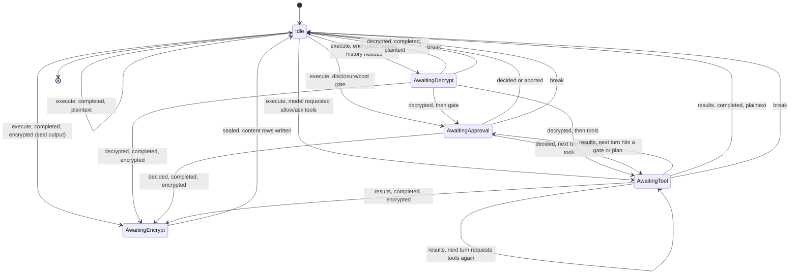
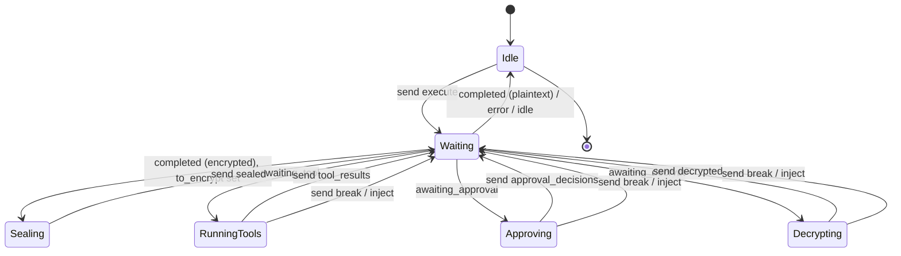

# Run state machine

- [Run state machine](#run-state-machine)
  - [The run and its lock](#the-run-and-its-lock)
  - [Crash recovery](#crash-recovery)
  - [The pause states](#the-pause-states)
  - [Tool mediation](#tool-mediation)
  - [Encrypt and decrypt](#encrypt-and-decrypt)
  - [The protocol messages](#the-protocol-messages)
    - [Responses](#responses)
    - [Continuations](#continuations)
  - [Where trace events are recorded](#where-trace-events-are-recorded)
  - [Router state machine](#router-state-machine)
  - [Client state machine](#client-state-machine)

A **run** is one user prompt carried to a terminal state. While it runs, the
router pauses between protocol turns and resumes on the next request, so it never
holds the run in memory. The points it can pause at are saved as the run state
machine, in the `session_run_state` row of the session. This page is the
authoritative description of those states, what each one waits for, and where the
run continues once the wait is answered. It is the model behind the `execute`,
`stream` and `continue` endpoints described in the
[execution protocol](./execution-protocol.md).

The single invariant everything here serves: **routing is deterministic and
never depends on an LLM.** The router classifies, selects a model and assembles
context by fixed rules; the client only executes on the user's machine and
renders results.

## The run and its lock

A session has **at most one in-flight run**, and that run is processed by **at
most one request at a time**. The saved state has two independent parts:

- **`phase`** — the durable checkpoint the run is paused at (`Idle` or one of the
  `Awaiting*` states below). This is the only thing that says where the run is.
- **`active`** — the processing lock. It is present (an `ActiveTurn` carrying a
  `lease`) only while a turn is actively being served, and absent otherwise. Its
  presence is what "running" means; it is orthogonal to `phase`.

Every accepted request acquires the lock, does its work, then releases the lock
and writes the next checkpoint:

```text
acquire: active = ActiveTurn { started_at, lease };  phase unchanged
process: classify / decrypt / resolve / invoke / mediate / persist …
release: phase = <next checkpoint>;  active = none
```

Because two requests must never process one run at once, admission is decided
against the saved row:

| Incoming                | `active`        | What the router does                                        |
| ----------------------- | --------------- | ----------------------------------------------------------- |
| `break`                 | any             | **Always accepted.** Abort the in-flight turn (supersede).  |
| `inject`                | any             | **Always accepted.** Supersede and continue with the input. |
| any other continuation  | present (live)  | **Rejected** — the run is busy.                             |
| any other continuation  | absent          | Accepted: acquire the lock and process.                     |
| `execute` (start a run) | present (live)  | **Rejected** — the run is busy.                             |
| `execute`               | absent / no row | Accepted: acquire the lock and process.                     |

`break` and `inject` are the user's escape hatches: the user can always stop a
run or redirect it, even while a turn is generating. Everything else waits its
turn.

## Crash recovery

Because `phase` always holds the last checkpoint and is never overwritten by the
lock, a crash in the middle of a turn loses nothing structural. On startup the
router **clears `active`** on every run-state row, then the run simply resumes
from its `phase`. The client, which never received a response, re-sends the same
continuation, and the router re-processes it. (Re-processing is made idempotent
by writing rows under deterministic ids, so a retry overwrites rather than
duplicates.)

A wedged run — a stuck lock that rejects every request forever — is impossible by
construction: a stale lock is just a flag the next startup drops.

## The pause states

Every `Awaiting*` state records **what it waits for** and a **`resume` step**
naming where the run continues once the wait is answered:

| Pause                         | Waits for                                 | `resume`      | On answer                                                  |
| ----------------------------- | ----------------------------------------- | ------------- | ---------------------------------------------------------- |
| `AwaitingDecrypt`             | the client opening recalled ciphertext    | `BuildPrompt` | finish building the prompt with the plaintext, then invoke |
| `AwaitingApproval` (disclose) | the user's yes/no on a remote disclosure  | `Invoke`      | yes → invoke; no → re-route locally or fail                |
| `AwaitingApproval` (cost)     | the user's yes/no on a cost ceiling       | `Invoke`      | yes → invoke; no → abort to idle                           |
| `AwaitingApproval` (plan)     | the user accepting or rejecting a plan    | `NextTurn`    | accept → next turn; reject → re-plan or idle               |
| `AwaitingTool`                | the client running the requested tools    | `NextTurn`    | record the results, re-classify, start the next turn       |
| `AwaitingEncrypt`             | the client sealing router-authored output | `Finalize`    | write the sealed content rows, then go idle                |

The `resume` step is the run-loop program counter; the approve-versus-reject
branch is handled inside that step. Each `Awaiting*` state carries only
references to rows already in storage — never raw content — so the state row
itself is never encrypted.

## Tool mediation

When the model requests tools, the router checks each call against the session's
tool permissions before involving the client:

| Mode    | What the router does                                                             |
| ------- | -------------------------------------------------------------------------------- |
| `deny`  | Synthesizes a denial result and feeds it back to the model. **No client pause.** |
| `allow` | Returns the call to the client to run.                                           |
| `ask`   | Returns the call to the client, flagged for approval, to confirm **and** run.    |

`deny` never reaches the client, so an `AwaitingTool` state only ever lists
`allow` and `ask` calls. Approval for an `ask` call is **folded into the tool
result**: the same machine that approves and runs the tool reports its decision
alongside the result, in one continuation. There is no separate approval round
trip for a tool.

Standalone approvals are reserved for decisions with **no tool to run** —
disclosing context to a remote provider, confirming a cost ceiling, and accepting
or rejecting a generated plan. Those raise `AwaitingApproval`.

A tool call that changes files (`write_file`, `edit_file`) records its proposed
change when the call is requested — the change is known from the model's
arguments — as a `session_diff` keyed by the call's id. When the result comes
back, the same id moves the diff to applied (a successful result) or rejected (a
failed one), folded in with the tool result like the approval. For an encrypted
session the diff body is sealed by the client, the same way as the tool result.

## Encrypt and decrypt

For an end-to-end-encrypted session the router holds no key, so the client does
all the crypto. The two directions are handled differently because they depend on
the client differently. A plaintext session skips both entirely.

**Encrypt rides the data response.** Content the router authors — the assistant
message, a plan snapshot, an interrupted partial turn — cannot be stored as
plaintext, and the stateless router cannot hold it. So the data-bearing response
carries the data **and** a `to_encrypt` map. The router stores nothing for the
row up front: it keeps the row's non-secret metadata in the run state (which is
short-lived and cleared when the run ends, so it is never sealed) and writes the
metadata and the sealed content together when the ciphertext comes back on the
next continuation. The user sees the output immediately; only its stored copy
waits to be sealed. A tool call carries its sealed `result` the same way; the
client also seals it on the continuation, so the tool-call row's arguments are
left empty and the model's request rides the sealed assistant message. A
file-changing call also folds its proposed diff body into the same `to_encrypt`
map — its non-secret path is held in the run state as metadata — and the sealed
diff row is written alongside the tool call when the ciphertext returns. Session
memory the model writes during the run is stored in clear by the memory tool, so
a finishing encrypted run folds those rows into the final `to_encrypt` and seals
them in place. The deterministic trace the router records during the run is
handled the same way: its rows are written in clear as the run proceeds and
folded into the finishing seal, so no trace payload is left readable at rest.

**Decrypt is its own step.** To build a prompt the router must read stored
ciphertext, and it cannot proceed without the plaintext, so this is a real pause:
the response carries a `to_decrypt` map, and the client returns the opened
plaintext. The request context the resolver replays every turn — the run-input
bundle — is short-lived and stored in clear, so it never needs opening; only
sealed history does. When a pause also has router-authored content to seal, the
response may fold a `to_encrypt` map alongside `to_decrypt`, and the `decrypted`
continuation returns both the opened plaintext and the sealed ciphertext.

Content the client itself authors — the prompt, tool results — is sealed by the
client and travels as plaintext plus ciphertext together in one message, so it
needs no extra round trip.

Both maps are keyed by a content reference of the form `kind:id` (for example
`message:0194…`), where `kind` names the store the payload belongs to —
`message`, `tool_call`, `diff`, `plan`, `memory` or `trace` — so the router
dispatches each payload to the right place.

## The protocol messages

`execute` and `continue` share one response type; `continue` is answered with one
tagged message.

### Responses

A response is one envelope of `{ status, data, allowed_continuations }`: `status`
names the outcome, `data` carries that outcome's payload, and
`allowed_continuations` advertises the valid next client messages (always
including `break` while the run is live, empty for a terminal outcome):

| `status`            | Meaning                                                       | The client's next move                    |
| ------------------- | ------------------------------------------------------------- | ----------------------------------------- |
| `completed`         | The model finished; an assistant message is included.         | Render; if `to_encrypt` is set, seal it.  |
| `awaiting_tool`     | The model requested one or more client-run tools.             | Run them; continue with the results.      |
| `awaiting_approval` | A yes/no decision with no tool to run.                        | Ask the user; continue with the decision. |
| `awaiting_decrypt`  | Sealed history must be opened to build the prompt.            | Decrypt; seal any `to_encrypt`; continue. |
| `awaiting_encrypt`  | Router-authored output must be sealed before it is persisted. | Seal; continue with the ciphertext.       |
| `idle`              | The run finished and its content was persisted.               | Nothing to render; the run is over.       |
| `error`             | A terminal error ended the turn.                              | Surface it; the run is over.              |

A `completed` turn for a plaintext session is terminal. For an encrypted session
it carries `to_encrypt` and `allowed_continuations` of `[sealed, break]`;
the trailing `sealed` persists the sealed content and the router answers
with `idle`.

```json
{
  "status": "awaiting_tool",
  "data": {
    "tool_requests": [
      { "call_id": "c1", "name": "shell", "arguments": { "command": "cargo test" }, "requires_approval": "ask" }
    ],
    "to_encrypt": { "message:0195": "the assistant turn that requested the tool" },
    "trace_id": "trace:xyz"
  },
  "allowed_continuations": ["tool_results", "inject", "break"]
}
```

### Continuations

A continuation is a single `{ type, data }` message answering the current pause.
`break` carries no data:

| `type`               | Answers             | Carries                                                         |
| -------------------- | ------------------- | --------------------------------------------------------------- |
| `tool_results`       | `awaiting_tool`     | the results (approval folded in) plus any sealed router content |
| `approval_decisions` | `awaiting_approval` | the decisions plus any sealed router content                    |
| `decrypted`          | `awaiting_decrypt`  | a `content-ref → plaintext` map plus any sealed router content  |
| `sealed`             | a folded encrypt    | a `content-ref → ciphertext` map                                |
| `inject`             | any live state      | mid-run user input; supersedes the in-flight turn               |
| `break`              | any live state      | nothing; aborts the in-flight turn                              |

```json
{
  "type": "tool_results",
  "data": {
    "results": [{ "call_id": "c1", "content": "test result: ok", "is_error": false, "decision": "approved" }],
    "encrypted": { "message:0195": { "version": 1, "algorithm": "xchacha20poly1305", "key_id": "kf_ab12", "nonce": "…", "ciphertext": "…" } }
  }
}
```

```json
{ "type": "break" }
```

## Where trace events are recorded

The router records a deterministic trace as it runs. The events and where each is
written:

| Event              | Recorded when                                                 |
| ------------------ | ------------------------------------------------------------- |
| `Classification`   | after classifying the step                                    |
| `RoutingDecision`  | after matching a rule and selecting the model                 |
| `ContextSelection` | after building and finalizing the context                     |
| `ToolCall`         | on requesting a call, and again on recording its result       |
| `Approval`         | on each decision — a folded tool decision or a standalone one |
| `Message`          | on persisting a user or assistant message                     |
| `Cost`             | on recording usage after an invocation                        |

A `deny`ed tool call is recorded as a `ToolCall` with a denial result — visible
to the model, never a client pause. In an encrypted session the trace payloads
are router-authored, so they are sealed through the same `to_encrypt` fold.

## Router state machine

The lock (`active`) is orthogonal and omitted from the node labels; every
labelled transition runs under an acquired lock and releases it at the target
checkpoint.



An `inject` from any live state behaves like a `break` followed by a fresh turn;
it is elided from the diagram for legibility.

## Client state machine

The client never leads. Every client transition is driven by the response's
`status` and `allowed_continuations`; the client holds no authoritative run state
of its own, it only reacts and supplies what only the user's machine can — tool
execution, approvals, and the session key. `break` and `inject` are user-driven
edges available from any non-idle state.


