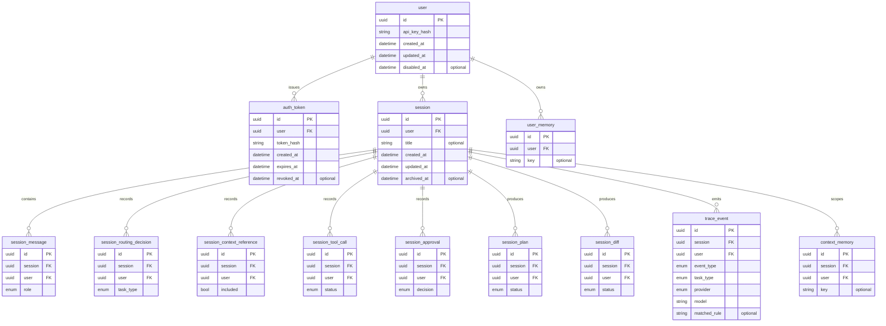
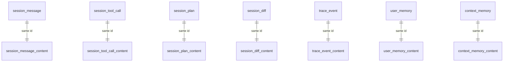

# Database schema

This document specifies the smista.ai storage schema as landed by issue #8
(storage domain entities and traits). It is the authoritative reference for the
SurrealDB tables, their fields, and the relations between them.

The storage layer persists users, sessions, authentication tokens, session
messages, routing decisions, context references, tool calls, approvals, plans,
diffs, trace events, and memory. Application code depends on the storage traits
and domain types, never on SurrealDB directly; SurrealDB-specific query logic is
isolated in the storage implementation.

## Design invariants

These rules hold for every table in the schema:

- **Record id is the id.** The SurrealDB record id (`table:⟨key⟩`, a `RecordId`)
  *is* the entity id. There is no redundant `id` column. The key is a UUIDv7
  generated in Rust (`Uuid::now_v7()`), so ids are deterministic, portable, and
  time-sortable. Session ids are globally unique.
- **Metadata and content are physically separated.** Every entity that carries
  sensitive free-form content has a paired 1:1 `<entity>_content` table sharing
  the same record id. The base table holds queryable metadata; the `_content`
  table holds only the encryptable payload. This enables future end-to-end
  encryption with no later migration — metadata stays queryable while content
  may be encrypted before persistence.
- **User ownership is enforced at the query boundary.** Every session-scoped row
  stores `user` redundantly so ownership checks and scoped queries never need a
  join. A user can only ever reach rows they own.
- **Secrets are never stored raw.** Only hashes of API keys and tokens are
  persisted. Tool-call arguments/results and diffs are sanitised for secrets
  before persistence, subject to the active privacy policy.

## Entity relations

Every entity maps to a dedicated table. Relations are explicit references: a
session-scoped row points at its `session` and (redundantly) its owning `user`.

Every session-scoped row above also carries a `user` reference (omitted from the
relation edges for readability) used to enforce ownership without a join.

## Metadata and content split

Content-bearing entities are split across two tables that share the same UUIDv7
record id; the identical key *is* the 1:1 join (`session_message:⟨uuid⟩` ↔
`session_message_content:⟨uuid⟩`). The base table is always queryable; the
`_content` table holds only the payload that may later be encrypted.

Metadata-only entities (`user`, `auth_token`, `session`,
`session_routing_decision`, `session_context_reference`, `session_approval`)
stay single-table.

## Tables

Each table below lists its fields. The `id` field is the SurrealDB record id
(UUIDv7 key); it is shown for completeness, not as a separate column. Owner
references (`user`, `session`) are stored as explicit `RecordId` references.

Enum-typed fields are stored as their lowercase textual form. A `Provider` enum
value is the provider identifier as it appears in a model reference: one of
`anthropic`, `openai`, `ollama`, or `openai-compat:<name>` for a named
OpenAI-compatible instance.

### user

An identity that can own sessions. In local-first deployments a user may be
created locally with no SaaS account; the same entity can later represent a
remote account. The raw API key is never stored — only its hash. A user has a
single API key.

| Field          | Type             | Description                            |
| -------------- | ---------------- | -------------------------------------- |
| `id`           | UUIDv7           | Unique user identifier (record id).    |
| `api_key_hash` | string           | Hash of the user's API key.            |
| `created_at`   | datetime         | When the user was created.             |
| `updated_at`   | datetime         | When the user was last updated.        |
| `disabled_at`  | datetime, option | When the user was disabled, if at all. |

### auth_token

A short-lived authentication session for the router. The CLI uses an auth token
after signing in with its user id and API key. The raw token is never stored;
expired or revoked tokens are rejected and cleaned up over time.

| Field        | Type             | Description                            |
| ------------ | ---------------- | -------------------------------------- |
| `id`         | UUIDv7           | Unique token identifier (record id).   |
| `user`       | user reference   | Owning user.                           |
| `token_hash` | string           | Hash of the issued token.              |
| `created_at` | datetime         | When the token was issued.             |
| `expires_at` | datetime         | When the token expires.                |
| `revoked_at` | datetime, option | When the token was revoked, if at all. |

### session

A resumable user interaction with smista.ai. Each session belongs to exactly one
user, who is the only identity allowed to access it.

| Field         | Type             | Description                             |
| ------------- | ---------------- | --------------------------------------- |
| `id`          | UUIDv7           | Globally unique session id (record id). |
| `user`        | user reference   | Owning user.                            |
| `title`       | string, option   | Human-readable session title.           |
| `created_at`  | datetime         | When the session was created.           |
| `updated_at`  | datetime         | When the session was last updated.      |
| `archived_at` | datetime, option | When the session was archived.          |

### session_message

A message exchanged during a session. Metadata stays queryable; the message body
lives in `session_message_content`.

| Field        | Type              | Description                          |
| ------------ | ----------------- | ------------------------------------ |
| `id`         | UUIDv7            | Unique message id (record id).       |
| `session`    | session reference | Session the message belongs to.      |
| `user`       | user reference    | Owner, enforced on every query.      |
| `role`       | `Role` enum       | Message role (user, assistant, ...). |
| `provider`   | `Provider` enum   | Provider that produced the message.  |
| `model`      | string            | Model that produced the message.     |
| `created_at` | datetime          | When the message was recorded.       |

### session_message_content

Paired 1:1 with `session_message` (same record id).

| Field     | Type   | Description       |
| --------- | ------ | ----------------- |
| `content` | string | The message body. |

### session_routing_decision

Records which provider/model pair was selected for a task and why. Metadata-only.

| Field           | Type              | Description                         |
| --------------- | ----------------- | ----------------------------------- |
| `id`            | UUIDv7            | Unique decision id (record id).     |
| `session`       | session reference | Session the decision belongs to.    |
| `user`          | user reference    | Owner, enforced on every query.     |
| `task_type`     | `TaskIntent` enum | Task the decision routed.           |
| `provider`      | `Provider` enum   | Selected provider.                  |
| `model`         | string            | Selected model.                     |
| `matched_rule`  | string, option    | Routing rule that matched, if any.  |
| `fallback_used` | bool, option      | Whether a fallback model was used.  |
| `override_used` | bool, option      | Whether a manual override was used. |
| `reason`        | string            | Why this provider/model was chosen. |
| `created_at`    | datetime          | When the decision was recorded.     |

### session_context_reference

Records what context was selected or excluded for a task. Stores references and
metadata only — not full file contents. Restricted contents are not persisted
unless policy allows. Metadata-only.

| Field        | Type              | Description                       |
| ------------ | ----------------- | --------------------------------- |
| `id`         | UUIDv7            | Unique reference id (record id).  |
| `session`    | session reference | Session the reference belongs to. |
| `user`       | user reference    | Owner, enforced on every query.   |
| `path`       | string, option    | Path of the referenced context.   |
| `kind`       | string            | Kind of context reference.        |
| `included`   | bool              | Whether the context was included. |
| `reason`     | string            | Why it was included or excluded.  |
| `created_at` | datetime          | When the reference was recorded.  |

### session_tool_call

Records a tool request and its execution result. Arguments, result, and error
are sensitive and live in `session_tool_call_content`; they are sanitised for
secrets before persistence.

| Field          | Type              | Description                       |
| -------------- | ----------------- | --------------------------------- |
| `id`           | UUIDv7            | Unique tool-call id (record id).  |
| `session`      | session reference | Session the tool call belongs to. |
| `user`         | user reference    | Owner, enforced on every query.   |
| `tool_name`    | string            | Name of the invoked tool.         |
| `status`       | enum              | Execution status.                 |
| `created_at`   | datetime          | When the tool call was requested. |
| `completed_at` | datetime, option  | When the tool call completed.     |

### session_tool_call_content

Paired 1:1 with `session_tool_call` (same record id).

| Field       | Type           | Description                      |
| ----------- | -------------- | -------------------------------- |
| `arguments` | string         | Tool-call arguments (sanitised). |
| `result`    | string, option | Tool-call result (sanitised).    |
| `error`     | string, option | Error, if the tool call failed.  |

### session_approval

Records a user decision for an operation that required confirmation — a tool
call, file write, shell command, network access, or remote-provider context
disclosure. Metadata-only.

| Field         | Type              | Description                         |
| ------------- | ----------------- | ----------------------------------- |
| `id`          | UUIDv7            | Unique approval id (record id).     |
| `session`     | session reference | Session the approval belongs to.    |
| `user`        | user reference    | Owner, enforced on every query.     |
| `target_type` | string            | Type of operation being approved.   |
| `target_id`   | string            | Id of the operation being approved. |
| `decision`    | enum              | Approve or reject.                  |
| `reason`      | string, option    | Why the decision was made.          |
| `created_at`  | datetime          | When the decision was recorded.     |

### session_plan

Records a generated or approved execution plan. The plan snapshot lives in
`session_plan_content`; the queryable hash and status stay in the base table.

| Field          | Type              | Description                     |
| -------------- | ----------------- | ------------------------------- |
| `id`           | UUIDv7            | Unique plan id (record id).     |
| `session`      | session reference | Session the plan belongs to.    |
| `user`         | user reference    | Owner, enforced on every query. |
| `path`         | string            | Path the plan applies to.       |
| `status`       | enum              | Plan status.                    |
| `created_at`   | datetime          | When the plan was created.      |
| `updated_at`   | datetime          | When the plan was last updated. |
| `approved_at`  | datetime, option  | When the plan was approved.     |
| `content_hash` | string, option    | Hash of the plan snapshot.      |

### session_plan_content

Paired 1:1 with `session_plan` (same record id).

| Field              | Type           | Description                |
| ------------------ | -------------- | -------------------------- |
| `content_snapshot` | string, option | Snapshot of the plan body. |

### session_diff

Records a proposed or applied file modification. The diff body lives in
`session_diff_content` and is stored only after secret filtering, per the active
privacy policy.

| Field        | Type              | Description                     |
| ------------ | ----------------- | ------------------------------- |
| `id`         | UUIDv7            | Unique diff id (record id).     |
| `session`    | session reference | Session the diff belongs to.    |
| `user`       | user reference    | Owner, enforced on every query. |
| `path`       | string            | Path the diff applies to.       |
| `status`     | enum              | Diff status.                    |
| `created_at` | datetime          | When the diff was created.      |
| `applied_at` | datetime, option  | When the diff was applied.      |

### session_diff_content

Paired 1:1 with `session_diff` (same record id).

| Field  | Type   | Description                      |
| ------ | ------ | -------------------------------- |
| `diff` | string | The diff body (secret-filtered). |

### trace_event

A structured, append-only event recorded during task execution; the detailed
history surfaced by `/trace`. The append/get ops live on the storage `Database`;
the assembled read view is `smista-core`'s `Trace`. The routing fields
(`task_type`, `provider`, `model`, `matched_rule`) carry the routing context of
the task that emitted the event, so `get_latest_trace` assembles the `Trace`
from trace events alone. The free-form payload lives in `trace_event_content`.

| Field          | Type              | Description                        |
| -------------- | ----------------- | ---------------------------------- |
| `id`           | UUIDv7            | Unique event id (record id).       |
| `session`      | session reference | Session the event belongs to.      |
| `user`         | user reference    | Owner, enforced on every query.    |
| `event_type`   | enum              | Kind of trace event.               |
| `task_type`    | `TaskIntent` enum | Task the emitting context served.  |
| `provider`     | `Provider` enum   | Provider that served the task.     |
| `model`        | string            | Model that served the task.        |
| `matched_rule` | string, option    | Routing rule that matched, if any. |
| `created_at`   | datetime          | When the event occurred.           |

### trace_event_content

Paired 1:1 with `trace_event` (same record id).

| Field     | Type   | Description               |
| --------- | ------ | ------------------------- |
| `payload` | string | Structured event payload. |

The `payload` is a JSON object, serialized to a string. Its shape is determined
by the owning event's `event_type` and mirrors the fields of the matching
metadata entity. `?` marks an optional field; `int` is a JSON number and a
monetary `cost` is a decimal string (never a float).

| `event_type`        | `payload` shape                                                                                                                      |
| ------------------- | ------------------------------------------------------------------------------------------------------------------------------------ |
| `message`           | `{ "role": string, "provider": string, "model": string }`                                                                            |
| `routing_decision`  | `{ "provider": string, "model": string, "matched_rule"?: string, "fallback_used"?: bool, "override_used"?: bool, "reason": string }` |
| `context_selection` | `{ "path"?: string, "kind": string, "included": bool, "reason": string }`                                                            |
| `tool_call`         | `{ "tool_name": string, "status": string, "arguments"?: string, "result"?: string, "error"?: string }`                               |
| `approval`          | `{ "target_type": string, "target_id": string, "decision": string, "reason"?: string }`                                              |
| `cost`              | `{ "provider": string, "model": string, "input_tokens": int, "output_tokens": int, "cost"?: string }`                                |

On read, each event row (metadata + this payload) is mapped to one `TraceEvent`
in the assembled `smista-core` `Trace`, where this payload becomes the event's
`payload` field.

### user_memory

A long-term, model-populated preference owned by a user. Untouched by session
deletion; subject to retention. The fact lives in `user_memory_content`.

| Field        | Type           | Description                          |
| ------------ | -------------- | ------------------------------------ |
| `id`         | UUIDv7         | Unique memory id (record id).        |
| `user`       | user reference | Owner of the memory.                 |
| `key`        | string, option | Topic; lets an update target a fact. |
| `created_at` | datetime       | When the fact was first recorded.    |
| `updated_at` | datetime       | When the fact was last changed.      |

### user_memory_content

Paired 1:1 with `user_memory` (same record id).

| Field     | Type   | Description          |
| --------- | ------ | -------------------- |
| `content` | string | The remembered fact. |

### context_memory

A per-session, model-populated memory owned by a session and a user. Cascades on
session delete (no SurrealDB FK cascade — `delete_session` removes
`context_memory WHERE session = $session` and its `_content` row). The fact lives
in `context_memory_content`.

| Field        | Type              | Description                          |
| ------------ | ----------------- | ------------------------------------ |
| `id`         | UUIDv7            | Unique memory id (record id).        |
| `session`    | session reference | Session the memory belongs to.       |
| `user`       | user reference    | Owner, enforced on every query.      |
| `key`        | string, option    | Topic; lets an update target a fact. |
| `created_at` | datetime          | When the fact was first recorded.    |
| `updated_at` | datetime          | When the fact was last changed.      |

### context_memory_content

Paired 1:1 with `context_memory` (same record id).

| Field     | Type   | Description          |
| --------- | ------ | -------------------- |
| `content` | string | The remembered fact. |

## Indexes

Indexes are declared on the **metadata** tables only:

- **Owner load** — `user_memory` by `user`; `context_memory` by `session`. Used
  to load all memory for an owner before a task runs.
- **Unique upsert-by-key** — unique index on `(user, key)` for `user_memory` and
  on `(session, key)` for `context_memory`, applied to keyed rows only. Keyless
  rows (`key` is null) stay unconstrained, so multiple keyless facts can coexist
  while a keyed fact can be upserted in place.

## Cascade and retention

- Deleting a session cascades to all session-scoped rows and their `_content`
  pairs, including `context_memory`. The cascade is explicit in `delete_session`,
  not enforced by SurrealDB.
- `user_memory` survives session deletion and falls under user retention
  settings.
- Expired and revoked `auth_token` rows are cleaned up over time.

Cascade/cleanup mechanics and retention policy are implemented in #10; this
schema defines the substrate they operate on.
