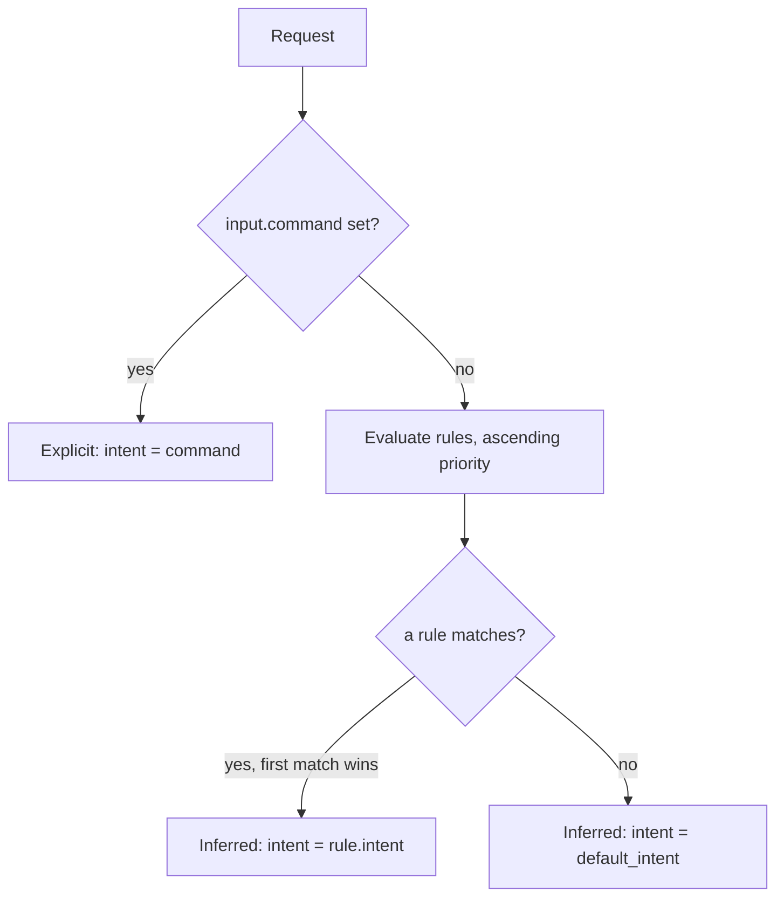

# Task intent classification

- [Task intent classification](#task-intent-classification)
  - [Where it runs](#where-it-runs)
  - [The intents](#the-intents)
  - [What the classifier reads](#what-the-classifier-reads)
  - [The algorithm](#the-algorithm)
    - [Explicit override](#explicit-override)
    - [Rule evaluation](#rule-evaluation)
    - [Confidence](#confidence)
    - [Typo-tolerant keyword matching](#typo-tolerant-keyword-matching)
  - [The classification result](#the-classification-result)
  - [Classifying every turn](#classifying-every-turn)
  - [Skills](#skills)
  - [In the HTTP API](#in-the-http-api)
  - [Worked examples](#worked-examples)
  - [Refinements](#refinements)

Classification is the first stage of routing: it maps a request to a single
[`TaskIntent`](#the-intents) — `chat`, `edit`, `review` and so on — which the
[routing policy](../api/http-api.md#policy) then matches to a model. It is
**purely deterministic and never calls an LLM**, the core invariant of
smista.ai. The model that serves a turn may change, but the decision of _what
kind of work this is_ never depends on a model.

This document follows the types in `smista-core`:
[`Classification`, `ClassificationConfig`, `ClassificationRule`, `Confidence`,
`IntentSource`](../api/http-api.md) (the `smista_core::policy` module) and
`TaskIntent` (the `smista_core::intent` module).

## Where it runs

Classification runs **on the router**, on every turn (see
[the execution protocol](./execution-protocol.md#the-turn-loop)). The router is
the only party that holds the workflow state a classifier reads — session
history, the latest tool results, the assembled context — so the client cannot
classify for it, and a single prompt can be classified differently as the work
progresses.

The user still owns the rules. The `ClassificationConfig` is authored in the CLI
configuration (`[classification]` in `config.toml`) and **sent to the router in
the request**, exactly like the routing, tools and privacy policy. The router
evaluates it; it never invents rules of its own.

## The intents

A `TaskIntent` is the kind of work one step performs. Each serializes to its
lowercase name.

| Intent      | Meaning                                               |
| ----------- | ----------------------------------------------------- |
| `chat`      | Free-form conversation with no specialized objective. |
| `plan`      | Producing a plan or breaking a task into steps.       |
| `edit`      | Modifying existing code or text.                      |
| `review`    | Assessing code or text and giving feedback.           |
| `summarize` | Condensing longer content into a shorter form.        |
| `prompt`    | Crafting or refining a prompt for another model.      |
| `skill`     | Invoking a named skill or tool-driven capability.     |

`chat` is the default — the intent returned when nothing more specific matches.

## What the classifier reads

The classifier is a function of observable signals only:

- The **prompt text**.
- The **explicit command** (`input.command`) when the user named one — it
  overrides inference.
- The **available context kinds** for the task, such as `git_diff` or
  `pull_request`, matched by a rule's `requires_any_context`.
- The **classification config**: the ordered `rules` and the `default_intent`.

A `ClassificationRule` is intentionally narrow today — `intent`, `priority`
(default `1000`), `keywords` and `requires_any_context`. The broader, planned
signal set (explicit slash command, prompt prefix, workflow state, skill or
template invocation) is the direction the rule grows into; see
[Refinements](#refinements).

## The algorithm



### Explicit override

If `input.command` is set, that intent is used directly: `source` is `Explicit`,
`matched_rule` is `None`, and no `confidence` is reported — an explicit intent is
certain, not inferred. An explicit command **always wins**; no rule can override
it.

### Rule evaluation

With no explicit command, the rules are evaluated in **ascending `priority`**
(lower first); for equal priorities, configuration order breaks the tie. The
**first matching rule wins**.

A rule matches when **every present condition holds**, and a condition list is
satisfied by **any** of its entries:

- `keywords` — matches when **any** keyword appears in the prompt.
- `requires_any_context` — matches when **any** named context kind is available.

That is AND across the two condition kinds, OR within each list — the same
shape the [routing matcher](../api/http-api.md#policy) uses. A rule with no
conditions matches every request, which makes it a useful low-priority
catch-all. A matched rule yields `source: inferred` and records its index in
`matched_rule` so a trace can point back to the configured rule (classification
rules are addressed by index, not by name).

When no rule matches, the result is `default_intent` (`chat` unless configured
otherwise), with `source: inferred` and `matched_rule: None`.

### Confidence

`Confidence` is a coarse, deterministic signal-strength label — `low`, `medium`
or `high` — **not** a probability. It is derived from how strong the winning
match was, so the same inputs always produce the same label:

| Outcome                                                          | `confidence` |
| ---------------------------------------------------------------- | ------------ |
| Explicit command                                                 | omitted      |
| A rule matched on both `keywords` and `requires_any_context`     | `high`       |
| A rule matched on a single condition kind                        | `medium`     |
| A conditionless catch-all rule matched, or `default_intent` used | `low`        |

Confidence never gates the decision — the matched intent is used regardless. It
is a diagnostic the trace and `/preview` surface so a user can see how firm the
inference was.

### Typo-tolerant keyword matching

Keyword matching is **token-based and typo-tolerant**, not a raw substring scan.
The prompt is split into lowercase alphanumeric tokens, and each keyword is
compared to each token using **Optimal String Alignment (OSA)** edit distance —
the transposition-aware variant, so the common `impelment`/`implement` swap is a
single edit. An exact token match is the fast path; only when no token matches
exactly does a keyword fall through to a fuzzy comparison.

The tolerance is a **static, length-bucketed** edit-distance cap — never
user-configurable — so the feature stays invisible and fully deterministic (no
model, and the same prompt always classifies the same way). The buckets follow
Meilisearch's stricter model, because the keyword set is small and a false
positive mis-routes a turn:

| Keyword length | Maximum OSA distance |
| -------------- | -------------------- |
| < 5            | 0 (exact only)       |
| 5–8            | 1                    |
| >= 9           | 2                    |

The cap never exceeds two edits. Short keywords such as `edit`, `plan` and
`chat` require an exact match, which avoids collisions like `edit` matching
`audit`. A keyword wholly contained in a longer token (or the reverse) is taken
to be a different word rather than a typo, so `review` does not match `preview`.

A keyword matched through a typo is a weaker signal than an exact hit, so when a
rule matches **only** through a fuzzy keyword its [confidence](#confidence) is
capped at `medium`, even when matching both condition kinds would otherwise make
it `high`.

## The classification result

Classification produces one `Classification`:

| Field          | Type                                  | Meaning                                                             |
| -------------- | ------------------------------------- | ------------------------------------------------------------------- |
| `intent`       | `TaskIntent`                          | The detected intent.                                                |
| `source`       | `explicit` \| `inferred`              | Whether the user named the intent or the router inferred it.        |
| `reason`       | string                                | Human-readable explanation, e.g. `keyword 'review' matched rule 0`. |
| `matched_rule` | integer, optional                     | Index into `ClassificationConfig.rules`; absent when none matched.  |
| `confidence`   | `low` \| `medium` \| `high`, optional | Signal strength for an inferred intent; absent when explicit.       |

The `intent` flows into the [routing stage](../api/http-api.md#policy): it
becomes the `RoutingContext.intent` a `RoutingRule` matches on, which then
selects the model.

## Classifying every turn

Because the router re-classifies before every model invocation (see
[the turn loop](./execution-protocol.md#the-turn-loop)), the intent can drift
within a single run as the state grows: a run may classify `plan` on the first
turn, `edit` once it starts changing files, and `review` at the end — each
re-routed to the model best suited to it, transparently.

An explicit `input.command` applies to the turn that carried it (the run's first
turn). Later inner turns have no new command, so they infer from the evolving
state — unless the user injects a fresh command with
[mid-run input](./execution-protocol.md#mid-run-input-and-aborting).

## Skills

The router never guesses which skills are relevant from the prompt. A skill is
active for a turn in one of two ways, and the client tells the router which:

- **Invoked skills** — the ones the user explicitly invoked. These are
  authoritative: a [routing rule](../api/http-api.md#policy) may require a
  `skill`, and it matches a rule when the invoked set contains a skill of that
  name (an exact match, never an inferred one). Their instructions are added to
  the model preamble.
- **Available skills** — offered for the serving model to activate by reading
  their content. These never influence routing; the model decides whether to
  apply one.

Both travel in the request (`invoked_skills` and `available_skills` under
`attachments`). Classification stays purely about the [intent](#the-intents);
skills are carried alongside it, not derived from the prompt.

## In the HTTP API

Classification touches the [HTTP API](../api/http-api.md#executing-a-task) at
three points:

- **Input.** `input.command` carries an explicit `TaskIntent`; `null` asks the
  router to infer. `input.explicit_model` is unrelated — it bypasses _routing_,
  not classification.
- **Config.** The classification rules travel with the request: the policy block
  carries a `classification` block (`ClassificationConfig`) beside `routing`,
  `tools` and `privacy`, so the router evaluates the user's own rules.
- **Output.** The full `Classification` (`source`, `reason`, `confidence`, the
  matched rule) is returned in the execute and `/preview` responses, beside the
  routed `task_type`.

## Worked examples

A config with one review rule:

```json
{
  "default_intent": "chat",
  "rules": [
    { "intent": "review", "priority": 10, "keywords": ["review", "audit"], "requires_any_context": ["git_diff"] }
  ]
}
```

| Request                                       | Result                                                                                                              |
| --------------------------------------------- | ------------------------------------------------------------------------------------------------------------------- |
| `command: "edit"`, any prompt                 | `edit`, `source: explicit`, no `confidence`.                                                                        |
| "review my changes", `git_diff` available     | `review`, `source: inferred`, `matched_rule: 0`, `confidence: high`.                                                |
| "review this idea", no `git_diff`             | `chat`, `source: inferred`, `matched_rule: None`, `confidence: low` (the rule needs a context kind that is absent). |
| "what does this function do?", no rules match | `chat`, `source: inferred`, `confidence: low`.                                                                      |

## Refinements

The doc reflects where the types are heading; these refinements are planned:

- **Richer rule signals** — explicit slash command, prompt prefix, workflow
  state, skill or template invocation, beyond `keywords` and
  `requires_any_context`.
- **On-demand skill bodies** — today every available skill ships its full
  content up front. A later refinement may send only metadata and fetch a body
  when the model activates it.
